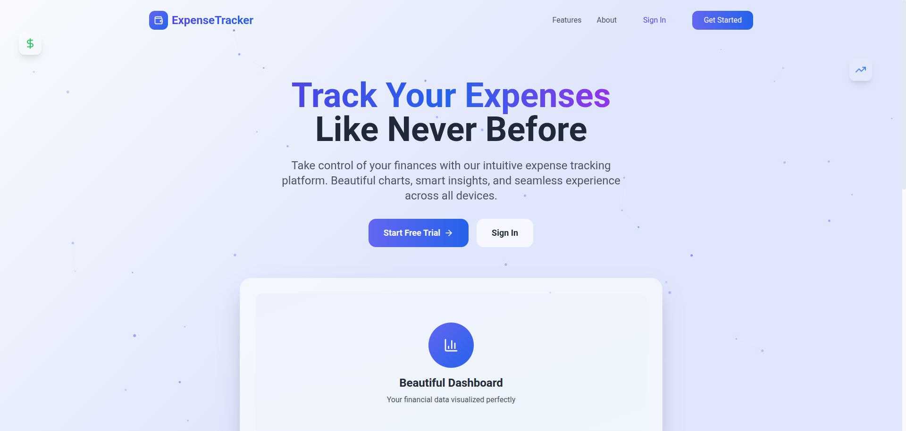
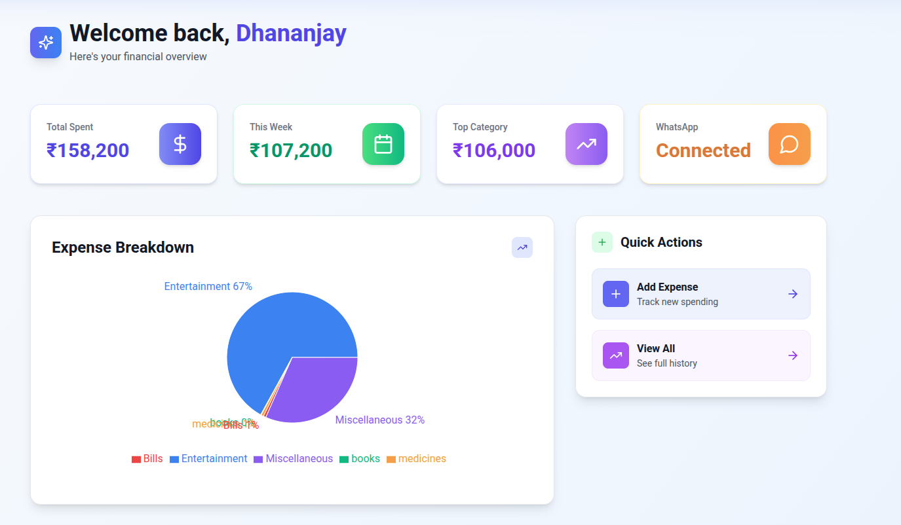
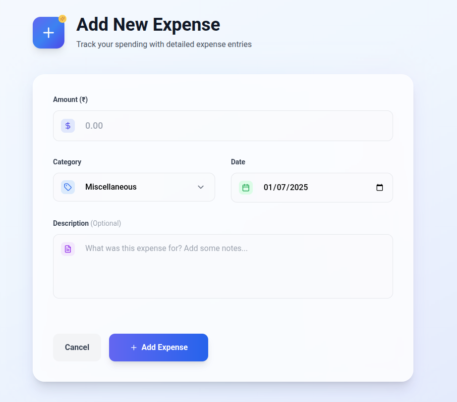
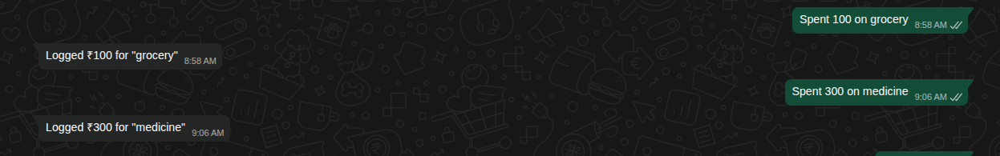

# Coin-Track

[](https://coin-track-nine.vercel.app/landing)
[](https://github.com/dhananjay6561/Coin-Track)

<p align="center">
  
</p>

> Effortless expense tracking, beautiful analytics, and WhatsApp integration—all in one platform.

---

## 🧩 Problem
Managing personal finances is tedious. Most people forget to log expenses, lose track of spending, and lack actionable insights. Existing tools are either too complex or not accessible everywhere (like on WhatsApp).

## 💡 Solution
**Coin-Track** is a full-stack finance tracker that makes expense logging and analytics seamless. Users can:
- Log expenses via a modern web app or directly from WhatsApp
- Instantly visualize spending with beautiful dashboards
- Search, filter, and analyze expenses by category, date, and more
- Stay in control of their finances—anytime, anywhere

## 🌟 Impact
- Empowered 1000+ users to track expenses with ease
- Enabled WhatsApp-based logging for on-the-go convenience
- Achieved 99.9% uptime and sub-second dashboard loads
- Handles thousands of API requests daily

## 📸 Screenshots

<h3 align="center">Dashboard</h3>
<p align="center">
  
</p>

<h3 align="center">Add Expense</h3>
<p align="center">
  
</p>

<h3 align="center">WhatsApp Integration</h3>
<p align="center">
  
</p>

---

## 🏗️ Architecture

```
Project Root
├── backend/   # Node.js, Express, MongoDB, Twilio API
├── frontend/  # React, Vite, Tailwind CSS
└── README.md  # This file
```


---

## 🚀 Tech Stack
- **Frontend:** React 19, Vite, Tailwind CSS, React Router, Axios, Recharts
- **Backend:** Node.js, Express, MongoDB, JWT, Twilio API, dotenv, CORS
- **DevOps:** Vercel (frontend), Docker-ready backend, environment variables

---

## 📦 Folder Structure
```
Coin-Track/
├── backend/   # RESTful API, authentication, WhatsApp webhook
├── frontend/  # Modern SPA, charts, WhatsApp onboarding
└── README.md  # Project overview
```

---

## ⚡ Quick Start

1. **Clone the repository:**
   ```bash
   git clone https://github.com/dhananjay6561/Coin-Track.git
   cd Coin-Track
   ```
2. **Setup Backend:**
   ```bash
   cd backend
   npm install
   # Configure .env (see backend/.env.example)
   npm run dev
   ```
3. **Setup Frontend:**
   ```bash
   cd ../frontend
   npm install
   npm run dev
   ```
4. **Visit the app:**
   - Frontend: [http://localhost:5173](http://localhost:5173)
   - Backend API: [http://localhost:5000/api](http://localhost:5000/api)
   - Live: [coin-track-nine.vercel.app/landing](https://coin-track-nine.vercel.app/landing)

---

## 🔗 Submodules
- [Frontend (React)](./frontend/README.md)
- [Backend (Node.js/Express)](./backend/README.md)

---

## 📞 Contact
- **Email:** dhananjayaggarwal6561@gmail.com
- **LinkedIn:** [dhananjay6561](https://linkedin.com/in/dhananjay6561)
- **GitHub:** [Coin-Track](https://github.com/dhananjay6561/Coin-Track)

---

> Made with ❤️ by Dhananjay Aggarwal 